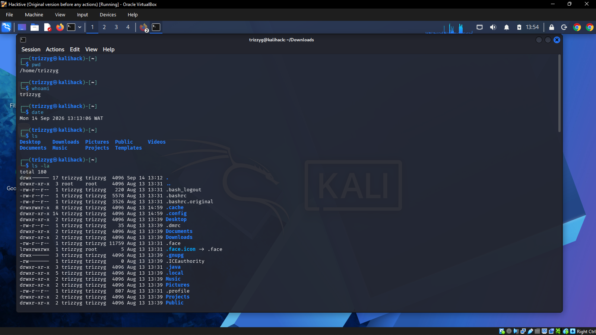
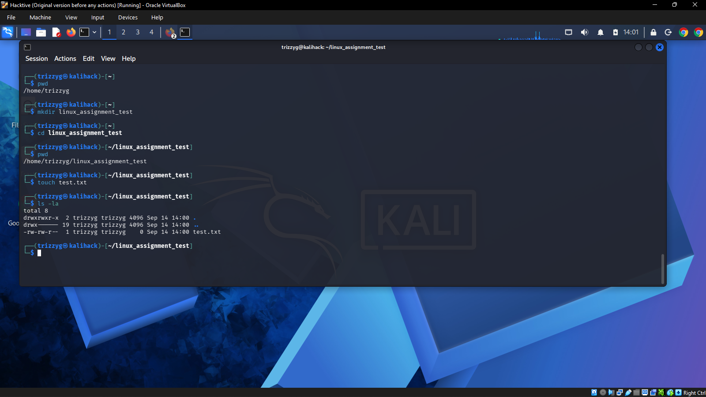
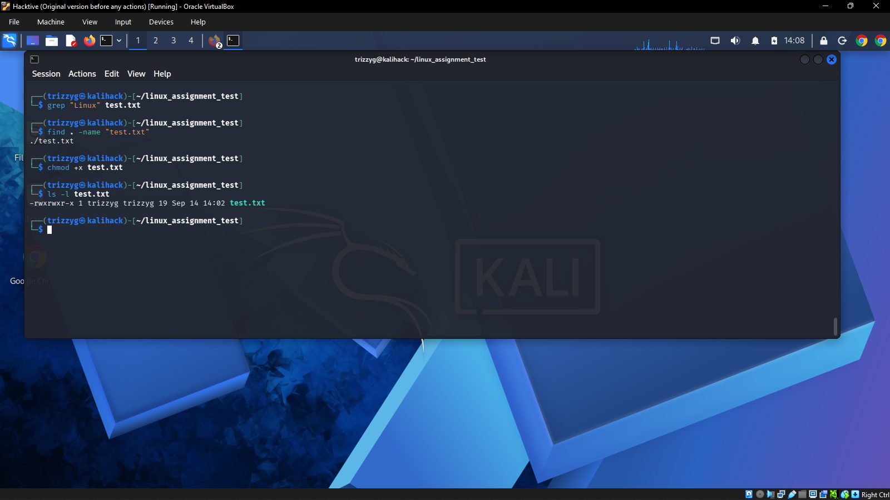
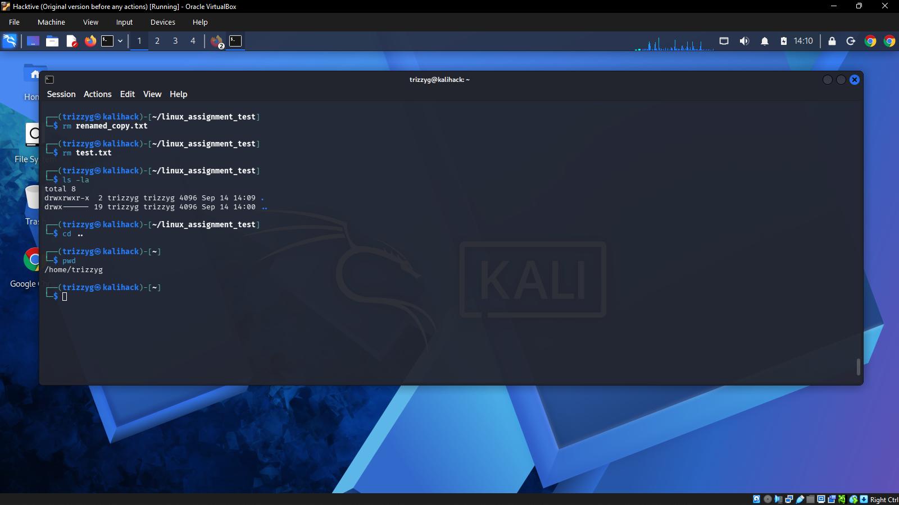
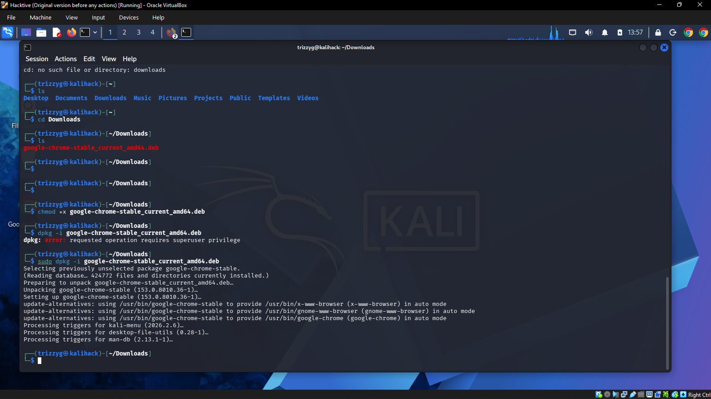

# Linux Commands — Linux & Cybersecurity Practice

## Student

**Name:** Akinsola Peniel

## Environment

- **Operating System:** Kali Linux
- **Terminal:** Kali Linux Terminal

## Objective

The objective of this assignment is to demonstrate practical knowledge of basic Linux command-line operations, including navigation, file and directory management, searching, and file permissions.

## Practical Exercises

### 1. Basic Linux Information

The following commands were executed in the Kali Linux terminal:

```bash
pwd
whoami
date
ls
ls -la
```

**What was demonstrated:**
- `pwd` — displays the current working directory.
- `whoami` — displays the current logged-in user.
- `date` — displays the current system date and time.
- `ls` — lists files and directories.
- `ls -la` — lists files and directories, including hidden files, with detailed information.

**Evidence:** Screenshot 1 — Basic Linux Information.



---

### 2. Directory and File Creation

The following commands were executed:

```bash
mkdir linux_assignment_test
cd linux_assignment_test
pwd
touch test.txt
ls -la
```

**What was demonstrated:**
- `mkdir` — creates a directory.
- `cd` — changes the current directory.
- `pwd` — confirms the current working directory.
- `touch` — creates an empty file.
- `ls -la` — verifies the created file and directory contents.

**Evidence:** Screenshot 2 — Directory and File Creation.



---

### 3. File Content, Copying and Renaming

The following commands were executed:

```bash
echo "Linux Assignment 1" > test.txt
cat test.txt
cp test.txt test_copy.txt
mv test_copy.txt renamed_test.txt
ls -la
cat renamed_test.txt
```

**What was demonstrated:**
- `echo` — writes text to a file.
- `cat` — displays the contents of a file.
- `cp` — creates a copy of a file.
- `mv` — moves or renames a file.
- `ls -la` — verifies the files in the directory.

The file content used for the practical exercise was `Linux Assignment 1`.

**Evidence:** Screenshot 3 — File Content, Copying and Renaming.


---

### 4. Searching and File Permissions

The following commands were executed:

```bash
grep "Linux" test.txt
find . -name "test.txt"
chmod +x test.txt
ls -l test.txt
```

**What was demonstrated:**
- `grep` — searches for matching text in a file.
- `find` — searches for a file by name.
- `chmod +x` — adds execute permission to the file.
- `ls -l` — displays detailed file permissions.

**Evidence:** Screenshot 4 — Searching and File Permissions.



---

### 5. Removing Files and Returning to the Parent Directory

The following commands were executed:

```bash
rm renamed_test.txt
rm test.txt
ls -la
cd ..
pwd
```

**What was demonstrated:**
- `rm` — removes files.
- `ls -la` — verifies the directory contents after removal.
- `cd ..` — returns to the parent directory.
- `pwd` — confirms the current working directory.

**Evidence:** Screenshot 5 — File Removal and Navigation.



---

## Additional Linux Evidence

### 6. Installing Google Chrome from the Downloads Directory

An additional practical exercise was documented showing the installation of a downloaded Google Chrome package from the `/Downloads` directory in Kali Linux. This provides supplementary evidence of working with downloaded files and installing software from the Linux command line.

**Evidence:** Screenshot 6 — Chrome Installation from Downloads.



---

## Command Summary

| Command | Purpose |
|---|---|
| `pwd` | Displays the current working directory |
| `whoami` | Displays the current user |
| `date` | Displays the current date and time |
| `ls` | Lists directory contents |
| `ls -la` | Lists detailed contents, including hidden files |
| `cd` | Changes directory |
| `mkdir` | Creates a directory |
| `touch` | Creates an empty file |
| `echo` | Writes text to a file or displays text |
| `cat` | Displays file contents |
| `cp` | Copies files or directories |
| `mv` | Moves or renames files/directories |
| `rm` | Removes files/directories |
| `grep` | Searches for matching text |
| `find` | Searches for files/directories |
| `chmod` | Changes file permissions |

## Conclusion

This practical exercise provided hands-on experience with essential Linux command-line operations using Kali Linux. The exercises covered filesystem navigation, directory and file creation, file manipulation, text searching, permission management, file removal, and an additional software installation task.

## Evidence

The screenshots included in this repository are the student's original terminal screenshots from the practical exercises. They document the work performed in the Kali Linux environment.
